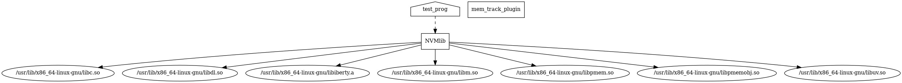

# NVMLib

## Compiling 

* Clone the repo
```shell
$ git clone https://github.com/gautamramk/NVMLib
```

* Make a new build directory
```shell
$ cd NVMLib
$ mkdir build
```

* `cd` into the build directory and execute `make`
```shell
$ cd build
$ export CC=<path to C compiler>
$ export CXX=<path to C++ compiler>
$ cmake ..
$ make
```
Here `export CC=<path to C compiler>` `export CXX=<path to C++ compiler>` are optional, but recomended because `cmake` defaults to `cc` as the compiler.

Here we do `cmake` before `make` inorder to rebuild the `Makefiles`. This should be used when a additional files are added to the source code.

* For verbose build use `make VERBOSE=1`

After `make` the static library file (`libNVMlib.a`) and the gcc-plugin (`libmem_track_plugin.so`) will be in `build/` and the intermediate files (`.i`) will be in `build/intermediate/`.

## Dependecy graph

